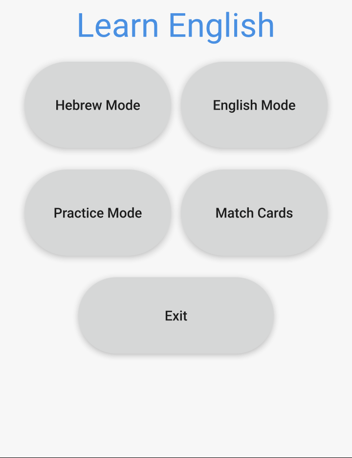

# 📱 Learn English - Android Version (QML)

  

## 📝 Overview

**Learn English** is an interactive mobile app built entirely with **QML (Qt Quick)**.  
It is designed for **Hebrew speakers** to expand their English vocabulary through engaging, intuitive learning modes — all within a clean, touch-optimized interface.

---

## 🚀 Key Features

✅ Game Modes: Translation, Practice, and Match Cards 
✅ Text-to-Speech Support for English and Hebrew  
✅ Real-time Feedback while you play  
✅ Clean UI optimized for touchscreens  
✅ Progress Tracking by difficulty levels  
✅ Offline Ready – no internet connection required  

---

## 📦 Installation

### 📲 Install via APK

1. **Download the APK** from the [Releases](https://github.com/itzhaksh/LearningEnglishApkQML/releases) page.  
2. **Transfer the APK** to your Android device via USB, cloud storage, or email.  
3. On your device, go to:  
   `Settings > Security > Allow Unknown Sources` (or “Install unknown apps”)  
4. **Open the APK** and follow the installation steps.  
5. Launch the **Learn English** app from your app drawer.

---

## 🎮 Game Modes

### 🔹 Translation Mode
- Translate words between Hebrew and English  
- Audio pronunciation using `TextToSpeech`  
- Keyboard language auto-detection  

### 🔹 Practice Mode
- Scroll through word lists  
- Hear correct pronunciations  
- Learn at your own pace  

### 🔹 Match Cards
- Match Hebrew and English words  
- Visual card interface  
- Helps reinforce vocabulary through repetition  

---

## 🛠️ Technology Stack

- **UI/UX**: QML (Qt Quick)  
- **Logic**: QML JavaScript  
- **Data**: JSON dictionaries (`dictionary_level1.json` to `dictionary_level5.json`)  
- **Audio**: `TextToSpeech` element in QML  
- **Build Tool**: Qt Creator (with Android deployment)

---

## 🖼️ UI Highlights

✔ Fully touch-optimized interface  
✔ Bilingual support (Hebrew & English)  
✔ Dynamic animations and visual feedback  
✔ Responsive layout for multiple screen sizes  

---

## ⚠ Troubleshooting

**App won’t install?**
- Make sure “Install Unknown Apps” is enabled in device settings
- Try clearing your APK installer’s cache

**No sound?**
- Ensure `TextToSpeech` is working on your device
- Check your device’s media volume 

---

## 📧 Contact

For questions, ideas or issues, feel free to reach out:  
📧 **itzhakshif@gmail.com**
